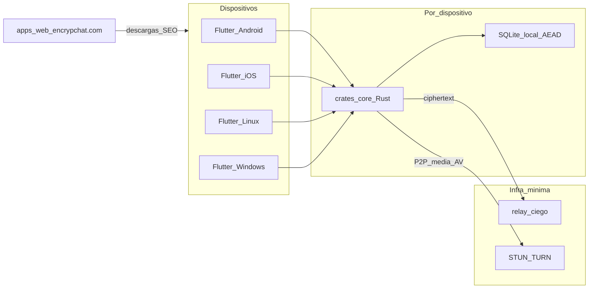
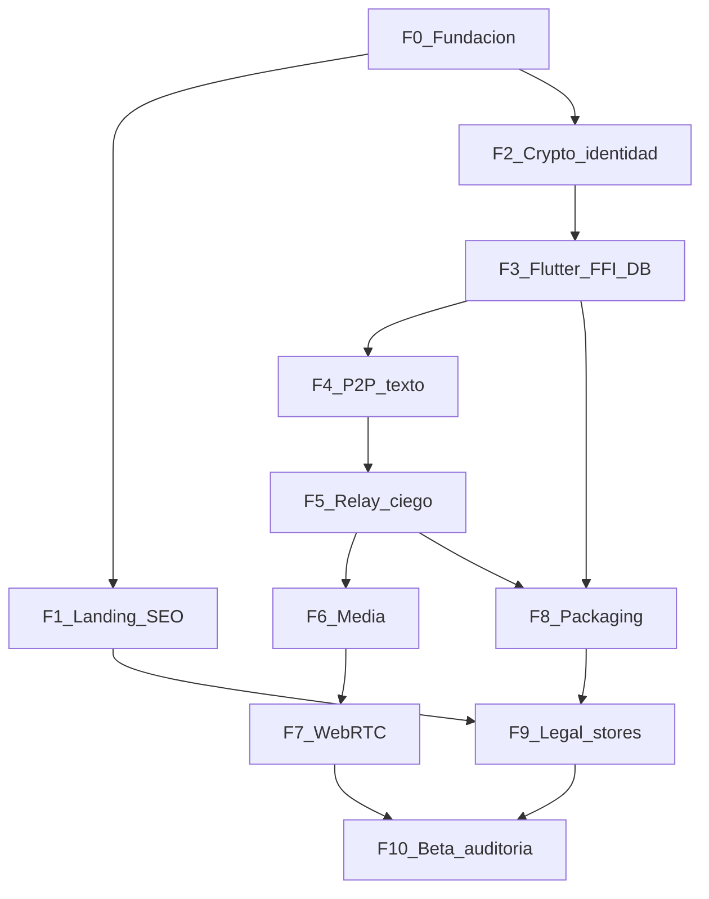

# Encrypchat — Roadmap

Documento vivo del plan de proyecto. Cada fase es **cerrada**: no se marca done hasta cumplir el Definition of Done (DoD).

| Campo | Valor |
| --- | --- |
| Dominio | https://encrypchat.com |
| Marca | Encrypchat |
| Tagline | DECENTRALIZED P2P CHAT \| ZERO-CLOUD |
| Cliente | Flutter — Android, iOS, Linux (Fedora), Windows |
| Core | Rust + libp2p + E2EE (`crates/core`) |
| Web | Next.js (`apps/web`) — landing/SEO, no chat |
| Relay | Ciego (`services/relay`) — ciphertext + TTL |

**Siguiente paso:** Probar F4–F7 en `dist/` / LAN y completar los campos de operador de F9 (entidad legal, contacto, firma release). F7: [phase-7.md](phase-7.md) · F9: [phase-9.md](phase-9.md). Checklist previo: [pre-f7-readiness.md](pre-f7-readiness.md).

---

## Objetivo

Construir Encrypchat de cero: app P2P E2EE multiplataforma + sitio indexable en **encrypchat.com** (SEO prioridad alta). Al final de cada fase hay algo demostrable y verificable.

## Decisiones fijadas

| Tema | Decisión |
| --- | --- |
| Monorepo | `apps/client` (Flutter), `apps/web` (Next.js), `crates/core` (Rust), `services/relay` |
| Identidad | Token = hash de clave pública; intercambio por QR / pegar token |
| Offline | Relay ciego (ciphertext + destino + TTL); no nube de contenido |
| Orden estratégico | Landing SEO temprano (fase 1) en paralelo al core |
| Hosting web | Cloudflare Pages (default) |

## Arquitectura



## Principios de fase

1. **Cerrada** — DoD cumplida o la fase no está done.
2. **Vertical** — entregable demostrable al cerrar.
3. **Invariantes** — sin plaintext en servidores; claims honestos.
4. **Agentes** — `/orquestador` parte; especialistas por capa (ver [AGENTS.md](../AGENTS.md)).
5. **Plataformas** — targets mínimos por fase; deuda de OS documentada en el DoD.

## Estado

| Fase | Nombre | Estado |
| --- | --- | --- |
| 0 | Fundación del monorepo | **Done** |
| 1 | Landing SEO encrypchat.com | **Done** (deploy DNS pendiente de token CF) |
| 2 | Identidad y crypto local | **Done** |
| 3 | Shell Flutter + FFI + DB cifrada | **Done** (gaps NDK/iOS/Windows en [phase-3.md](phase-3.md)) |
| 4 | Mensajería P2P texto (online) | **Done** — [phase-4.md](phase-4.md) (demo hardware = prueba tuya) |
| 5 | Relay ciego (offline) | **Done** (demo LAN; hardening en [audit-f5-relay.md](audit-f5-relay.md)) |
| 6 | Media | **Done** — [phase-6.md](phase-6.md) |
| 7 | Llamadas WebRTC | **Done** — [phase-7.md](phase-7.md) |
| 8 | Paridad multiplataforma / empaquetado | **In progress** — [phase-8.md](phase-8.md) (`dist/` Linux ~20 MB + Android arm64 ~16 MB; Win/iOS gap) |
| 9 | Legal + compliance tiendas | **Done (parte de repo)** — [phase-9.md](phase-9.md) · [legal-f9-stores.md](legal-f9-stores.md); bloqueado por operador (entidad legal, contacto, firma release) |
| 10 | Hardening, auditoría y beta | Pendiente |

---

## Fase 0 — Fundación del monorepo

**Estado:** done (2026-08-11)  
**Meta:** repo listo para desarrollar sin improvisar estructura.

### Alcance

- Estructura de carpetas + README raíz (este roadmap ya vive en `docs/`).
- Tooling: Flutter en `apps/client`, Rust crate en `crates/core`, Next.js en `apps/web`, stub `services/relay`.
- `.gitignore`, license placeholder.
- Scripts mínimos: `just` o `Makefile` con `check` / `dev:web` / `dev:client`.
- CI stub (lint/typecheck cuando exista código).

### Entregables

- Árbol monorepo inicializado y buildable en vacío.
- README con stack, plataformas, dominio, enlace a AGENTS.md y a este roadmap.

### DoD

- [x] Existen `apps/client`, `apps/web`, `crates/core`, `services/relay`, `docs/`
- [x] Flutter / Cargo / Next.js inicializados y verificados (`make check`: rust test, web build, flutter test)
- [x] README explica stack, plataformas, dominio, AGENTS.md, roadmap
- [x] Smoke `/auditor`: no secretos en repo

### Notas de cierre F0

- Linux desktop `flutter build linux` requiere CMake/GTK del sistema (documentado; empaquetado completo en Fase 8).
- Flutter SDK local opcional en `.tools/flutter` (gitignored).
- Checklist histórico: [phase-0.md](phase-0.md).

### Agentes

`/orquestador`, `/backend`, `/frontend`

### Cómo se ejecutó

Completada. Siguiente: **Fase 1** (landing SEO) y/o **Fase 2** (crypto).

---

## Fase 1 — Landing SEO en encrypchat.com (prioridad alta)

**Estado:** done (código + SEO estático; 2026-08-11) — HTTPS en dominio pendiente de `CLOUDFLARE_API_TOKEN` + DNS  
**Meta:** sitio público indexable que explica el producto y convierte a descarga.

### Alcance

- Next.js estático (`output: "export"`): home, features, download (4 OS), FAQ, privacy/terms stub.
- Metadata, canonical `https://encrypchat.com`, sitemap, robots, OG con logo.
- Schema `SoftwareApplication` + `Organization` + `FAQPage` (sin ratings inventados).
- Claims honestos (relay ciego matizado).
- Cloudflare Pages: `apps/web/wrangler.jsonc`.

### Entregables

`apps/web/out`, docs de deploy, [legal-f1-landing.md](legal-f1-landing.md).

### DoD

- [x] title/description/OG/canonical/sitemap/robots/FAQ AEO en el build
- [x] Checklist SEO + stubs legales revisados
- [x] CTAs Android, iOS, Linux Fedora, Windows
- [ ] HTTPS live en encrypchat.com + redirect www (operador: token Cloudflare)

### Deploy

```bash
cd apps/web && npm run build
npx wrangler pages deploy out --project-name encrypchat
```

### Agentes

`/seo`, `/frontend`, `/legal`, `/orquestador`

---

## Fase 2 — Identidad y crypto local (`crates/core`)

**Estado:** done (2026-08-11)  
**Meta:** identidad, token, cifrar/descifrar 1:1 en tests Rust (sin red).

### Alcance

- X25519 + token `ec_` + SHA-256(pubkey); ECDH efímero + ChaCha20-Poly1305.
- Sin I/O de red; tests verdes.
- [ffi-contract.md](ffi-contract.md), [audit-f2-crypto.md](audit-f2-crypto.md).

### DoD

- [x] Tests crypto verdes
- [x] Token reproducible desde pubkey
- [x] Secretos redactados en `Debug`
- [x] Review auditor (AAD diferido a F4 — Medium documentado)

### Agentes

`/backend`, `/auditor`

---

## Fase 3 — Shell Flutter + FFI + almacenamiento cifrado

**Estado:** done (2026-08-12) — gaps de empaquetado NDK/iOS/Windows en [phase-3.md](phase-3.md)  
**Meta:** app que arranca al menos en **Linux (Fedora)** y **Android**, crea identidad, DB cifrada, muestra token/QR.

### Alcance

- UI: onboarding, “mi token”, contactos vacío, lista de chats vacía.
- FFI mínimo (identity create/load, get token).
- Almacenamiento local para perfil/contactos/mensajes. **Entregado:** SQLite con cuerpos sellados con AEAD (clave en el almacén seguro del SO); el cifrado de fichero completo se difirió a F10 y **ya está hecho** ([audit-f3-storage.md](audit-f3-storage.md)).
- Tema marca (azul marino, logo).

### DoD

- [x] Build Linux + Android (toolchain gaps: cmake host / ANDROID_HOME+NDK — [phase-3.md](phase-3.md))
- [x] Identidad persiste tras reinicio
- [x] QR muestra token; export/import contacto local
- [x] Gap iOS/Windows documentado si aún no buildan
- [x] Pases `/frontend`, `/backend`, `/auditor` (storage de claves) — ver [audit-f3-storage.md](audit-f3-storage.md)

### Agentes

`/frontend`, `/backend`, `/auditor`

### Notas de cierre

Checklist: [phase-3.md](phase-3.md). FFI `0.3.0`. `make build-ffi` / `make build-client-linux`.

---

## Fase 4 — Mensajería P2P texto (ambos online)

**Estado:** done (2026-08-12) — ver [phase-4.md](phase-4.md)  
**Meta:** dos nodos envían texto E2EE en tiempo real (misma red o NAT básico).

### Alcance

- Transporte: Tokio TCP + hello por token (libp2p diferido; misma API de producto).
- UI chat 1:1; estados enviando/entregado/error.
- Sin relay: peer offline → fallo explícito (fail-loud).
- At-rest: `local_seal` / `db_key` en cuerpos (`body_sealed`).

### DoD

- [x] Demo integración core 2 nodos (tests)
- [x] Plaintext solo en memoria / sellado en DB local
- [x] Tests integración core (inject/send/recv)
- [x] `/auditor` handshake + framing — [audit-f4-messaging.md](audit-f4-messaging.md) (EH01 cerrado)
- [ ] Demo 2 dispositivos físicos LAN (manual — operador)

### Agentes

`/backend`, `/frontend`, `/auditor`

---

## Fase 5 — Relay ciego (offline)

**Estado:** done (2026-08-12) — [phase-5.md](phase-5.md) · [audit-f5-relay.md](audit-f5-relay.md)  
**Meta:** experiencia offline tipo WhatsApp sin nube de contenido.

### Alcance

- `services/relay`: blob cifrado + token destino + TTL; pull con PoP; borrado post-entrega.
- Cliente: offline → enqueue relay; online → pull/decrypt.
- Docs de operador: qué ve el relay (metadatos honestos; no plaintext).

### DoD

- [x] Relay HTTP + SQLite + PoP ECDH (`encrypchat_core` 0.6.0)
- [x] Cliente Flutter enqueue/pull (☁ en Chats)
- [x] Relay no puede descifrar contenido
- [x] TTL y borrado verificados
- [x] Copy landing ya matizado (relay opcional)
- [x] `/auditor` — limitaciones pre-prod documentadas

### Agentes

`/backend`, `/frontend`, `/auditor`, `/seo`, `/legal`

---

## Fase 6 — Media (fotos / archivos)

**Estado:** done (2026-08-12) — [phase-6.md](phase-6.md)  
**Meta:** adjuntos cifrados; P2P si ambos online; relay temporal cifrado si no (límite de tamaño).

### DoD

- [x] Foto 1:1 llega y se abre solo en destino (P2P)
- [x] Fallo claro si supera límite relay (256 KiB)
- [x] `/auditor` notes — [audit-f6-media.md](audit-f6-media.md)

### Agentes

`/backend`, `/frontend`, `/auditor`

---

## Fase 7 — Llamadas audio/video (WebRTC)

**Estado:** done (2026-08-12) — [phase-7.md](phase-7.md)  
**Meta:** llamada 1:1 P2P; señalización por canal Encrypchat ya cifrado.

### Alcance

- WebRTC en Flutter; mensajes de control E2EE para señalización.
- STUN público; TURN solo con infra propia documentada (gap).
- Permisos OS y UX de llamada.

### DoD

- [x] Audio + video en cliente (demo LAN; ≥2 OS vía package Linux/Android)
- [x] Sin SFU central de media
- [x] `/legal` — [legal-f7-calls.md](legal-f7-calls.md); `/auditor` — [audit-f7-calls.md](audit-f7-calls.md)

### Agentes

`/frontend`, `/backend`, `/auditor`, `/legal`

---

## Fase 8 — Paridad multiplataforma y empaquetado

**Estado:** **In progress / packaging-first** — [phase-8.md](phase-8.md).  
**Meta:** las 4 plataformas de primera clase tienen build instalable.  
**Corte actual:** Linux tarball (~20 MB) + Android APK arm64 (~16 MB) en `dist/`; Windows/iOS documentados como gaps (sin binarios inventados).

### Alcance

- Linux portable + `install.sh`; Android release APK (sideload / debug-signing OK para pruebas).
- Peso de artefactos: un solo ABI útil en Android, strip de símbolos, sin assets duplicados.
- Scripts stub + docs para iOS / Windows (requieren Mac / host Windows).
- Actualizar download en `apps/web` con copy honesta (Releases futuros / `dist/` local).
- Más adelante: Flatpak/RPM, firma Play, TestFlight, background/node lifecycle por OS.

### DoD

- [x] Linux + Android instalables vía `make package` → `dist/` (ver [phase-8.md](phase-8.md))
- [x] Landing download actualizada sin URLs 404 (`/seo`)
- [x] Gaps iOS / Windows listados con pasos exactos de build
- [x] APK adelgazado (90 MiB → 15,3 MiB) y verificación de ABI en el packaging
- [x] `key.properties` opcional para firma release sin romper el build
- [ ] Binarios iOS / Windows reales (bloqueado por host)
- [ ] `crates/core` enlazado en iOS (bloqueado por macOS)
- [ ] Firma release tiendas ejecutada

### Agentes

`/frontend`, `/backend`, `/seo`, `/orquestador`

---

## Fase 9 — Legal completo + compliance de tiendas

**Estado:** done en lo que depende del repo (2026-08-12) — [phase-9.md](phase-9.md)  
**Meta:** Privacy + ToS finales; store listings honestos; disclosures edad/crypto.

### Alcance

- Textos finales en encrypchat.com (ES/EN); privacy labels iOS; Data safety Play.
- Revisión claims vs arquitectura real (relay, STUN, at-rest, SQLCipher pendiente).
- Checklists de tienda accionables: [legal-f9-stores.md](legal-f9-stores.md).

### DoD

- [x] Privacy + ToS completos y honestos en `/es` y `/en` (sin stubs, sin buzón inventado)
- [x] Páginas legales linkeadas desde el footer, en el sitemap y con metadata/canonical/JSON-LD
- [x] Claims corregidos: SQLCipher marcado como pendiente; sin "zero metadata" ni "100 % privado"
- [x] Checklists Play Data safety + App Privacy + purpose strings + exportación
- [x] Listings alineados a zero-cloud + relay y STUN matizados
- [ ] Revisión por abogado (operador)
- [ ] Entidad legal, jurisdicción y buzón de contacto (operador)
- [ ] Firma release + cuentas de desarrollador (operador; ver [phase-8.md](phase-8.md))

### Agentes

`/legal`, `/seo`, `/frontend`

---

## Fase 10 — Hardening, auditoría y beta cerrada

**Meta:** release candidate usable por testers reales.

### Alcance

- DB local cifrada de fichero completo (SQLCipher), con migración de las bases planas que ya existen.
- Autenticación real de remitente en las dos rutas (`ECS1` en relay, EH02 en P2P) y anti-replay
  del lado del cliente — hallazgos F-2/F-3/F-4 de [audit-f10.md](audit-f10.md).
- Política para no-contactos con bandeja acotada y cuota de disco (F-6), zeroización del puente
  FFI (F-10) y llamadas bloqueantes fuera del isolate de UI (F-11).
- Threat model en `docs/threat-model.md`.
- Pase `/auditor` completo; tests/fuzz de relay y crypto.
- Beta: invitaciones, feedback, crash reporting **sin** contenido de chats.
- Checklist pre-1.0 actualizado aquí.

### DoD

- [x] SQLCipher en las cuatro plataformas + migración verificada antes de borrar la base plana ([audit-f3-storage.md](audit-f3-storage.md)) — iOS y Windows pendientes de build en su host (F8)
- [x] Remitente autenticado por relay (`ECS1` cableado, sin `from` declarado) + anti-replay por `msg_id` persistido y podado con la ventana de frescura
- [x] Bloquear corta una llamada en curso (F-4)
- [x] Nada de un no-contacto se guarda invisible: bandeja de solicitudes de solo texto con cuota, y techo de disco por par y global (F-6)
- [x] El puente FFI zeroiza cada buffer con clave o texto plano, y las llamadas bloqueantes del nodo corren en su propio isolate (F-10, F-11)
- [x] Threat model publicado en encrypchat.com/{es,en}/security (ES + EN, sitemap, hreflang, `Policy:` del security.txt)
- [ ] Hallazgos P0/P1 cerrados o aceptados por escrito — 14 de 15 cerrados; falta la **firma del
      operador** sobre el residuo de F-5, que no es un bug pendiente sino una propiedad del
      patrón de handshake: quien llama se identifica antes de que el otro haya probado nada
      ([audit-f10.md](audit-f10.md))
- [ ] Beta en ≥2 plataformas con chat + relay + 1 tipo de media
- [ ] SEO: changelog/blog opcional sin romper claims

### Agentes

`/auditor` (lead), `/orquestador`, `/backend`, `/frontend`, `/seo`, `/legal`

---

## Orden de ejecución



Tras **F0**, **F1** y **F2** pueden avanzar en paralelo.

## Fuera de alcance hasta post-1.0

- Grupos grandes / canales públicos
- Multi-device sync de historial (requiere diseño nuevo bajo zero-cloud)
- Bots / API cloud de mensajes
- Federaciones tipo Matrix (salvo decisión explícita futura)

## Referencias

- [AGENTS.md](../AGENTS.md) — ruteo de subagentes
- [`.cursor/rules/encrypchat.mdc`](../.cursor/rules/encrypchat.mdc) — invariantes de producto
- [`.cursor/rules/cursor-agents-routing.mdc`](../.cursor/rules/cursor-agents-routing.mdc) — cuándo delegar
