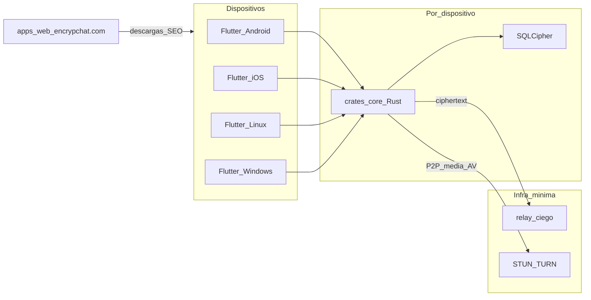
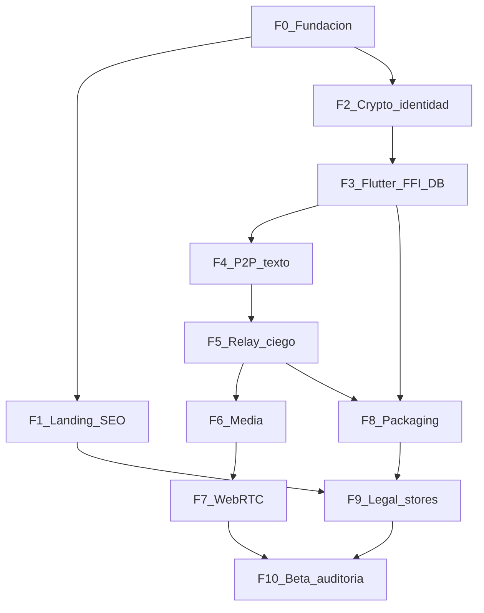

# Encrypchat — Roadmap

Documento vivo del plan de proyecto. Cada fase es **cerrada**: no se marca done hasta cumplir el Definition of Done (DoD).

| Campo | Valor |
| --- | --- |
| Dominio | https://encrypchat.com |
| Marca | Encrypchat |
| Tagline | DECENTRALIZED P2P CHAT \| ZERO-CLOUD |
| Cliente | Flutter — Android, iOS, Linux (Fedora), Windows |
| Core | Rust + libp2p + E2EE (`crates/core`) |
| Web | Next.js (`apps/web`) — landing/SEO, no chat |
| Relay | Ciego (`services/relay`) — ciphertext + TTL |

**Siguiente paso:** [Fase 3 — Shell Flutter + FFI + DB](#fase-3--shell-flutter--ffi--almacenamiento-cifrado). Deploy live de F1 requiere `CLOUDFLARE_API_TOKEN` (ver notas F1).

---

## Objetivo

Construir Encrypchat de cero: app P2P E2EE multiplataforma + sitio indexable en **encrypchat.com** (SEO prioridad alta). Al final de cada fase hay algo demostrable y verificable.

## Decisiones fijadas

| Tema | Decisión |
| --- | --- |
| Monorepo | `apps/client` (Flutter), `apps/web` (Next.js), `crates/core` (Rust), `services/relay` |
| Identidad | Token = hash de clave pública; intercambio por QR / pegar token |
| Offline | Relay ciego (ciphertext + destino + TTL); no nube de contenido |
| Orden estratégico | Landing SEO temprano (fase 1) en paralelo al core |
| Hosting web | Cloudflare Pages (default) |

## Arquitectura



## Principios de fase

1. **Cerrada** — DoD cumplida o la fase no está done.
2. **Vertical** — entregable demostrable al cerrar.
3. **Invariantes** — sin plaintext en servidores; claims honestos.
4. **Agentes** — `/orquestador` parte; especialistas por capa (ver [AGENTS.md](../AGENTS.md)).
5. **Plataformas** — targets mínimos por fase; deuda de OS documentada en el DoD.

## Estado

| Fase | Nombre | Estado |
| --- | --- | --- |
| 0 | Fundación del monorepo | **Done** |
| 1 | Landing SEO encrypchat.com | **Done** (deploy DNS pendiente de token CF) |
| 2 | Identidad y crypto local | **Done** |
| 3 | Shell Flutter + FFI + DB cifrada | **Siguiente** |
| 4 | Mensajería P2P texto (online) | Pendiente |
| 5 | Relay ciego (offline) | Pendiente |
| 6 | Media | Pendiente |
| 7 | Llamadas WebRTC | Pendiente |
| 8 | Paridad multiplataforma / empaquetado | Pendiente |
| 9 | Legal + compliance tiendas | Pendiente |
| 10 | Hardening, auditoría y beta | Pendiente |

---

## Fase 0 — Fundación del monorepo

**Estado:** done (2026-08-11)  
**Meta:** repo listo para desarrollar sin improvisar estructura.

### Alcance

- Estructura de carpetas + README raíz (este roadmap ya vive en `docs/`).
- Tooling: Flutter en `apps/client`, Rust crate en `crates/core`, Next.js en `apps/web`, stub `services/relay`.
- `.gitignore`, license placeholder.
- Scripts mínimos: `just` o `Makefile` con `check` / `dev:web` / `dev:client`.
- CI stub (lint/typecheck cuando exista código).

### Entregables

- Árbol monorepo inicializado y buildable en vacío.
- README con stack, plataformas, dominio, enlace a AGENTS.md y a este roadmap.

### DoD

- [x] Existen `apps/client`, `apps/web`, `crates/core`, `services/relay`, `docs/`
- [x] Flutter / Cargo / Next.js inicializados y verificados (`make check`: rust test, web build, flutter test)
- [x] README explica stack, plataformas, dominio, AGENTS.md, roadmap
- [x] Smoke `/auditor`: no secretos en repo

### Notas de cierre F0

- Linux desktop `flutter build linux` requiere CMake/GTK del sistema (documentado; empaquetado completo en Fase 8).
- Flutter SDK local opcional en `.tools/flutter` (gitignored).
- Checklist histórico: [phase-0.md](phase-0.md).

### Agentes

`/orquestador`, `/backend`, `/frontend`

### Cómo se ejecutó

Completada. Siguiente: **Fase 1** (landing SEO) y/o **Fase 2** (crypto).

---

## Fase 1 — Landing SEO en encrypchat.com (prioridad alta)

**Estado:** done (código + SEO estático; 2026-08-11) — HTTPS en dominio pendiente de `CLOUDFLARE_API_TOKEN` + DNS  
**Meta:** sitio público indexable que explica el producto y convierte a descarga.

### Alcance

- Next.js estático (`output: "export"`): home, features, download (4 OS), FAQ, privacy/terms stub.
- Metadata, canonical `https://encrypchat.com`, sitemap, robots, OG con logo.
- Schema `SoftwareApplication` + `Organization` + `FAQPage` (sin ratings inventados).
- Claims honestos (relay ciego matizado).
- Cloudflare Pages: `apps/web/wrangler.jsonc`.

### Entregables

`apps/web/out`, docs de deploy, [legal-f1-landing.md](legal-f1-landing.md).

### DoD

- [x] title/description/OG/canonical/sitemap/robots/FAQ AEO en el build
- [x] Checklist SEO + stubs legales revisados
- [x] CTAs Android, iOS, Linux Fedora, Windows
- [ ] HTTPS live en encrypchat.com + redirect www (operador: token Cloudflare)

### Deploy

```bash
cd apps/web && npm run build
npx wrangler pages deploy out --project-name encrypchat
```

### Agentes

`/seo`, `/frontend`, `/legal`, `/orquestador`

---

## Fase 2 — Identidad y crypto local (`crates/core`)

**Estado:** done (2026-08-11)  
**Meta:** identidad, token, cifrar/descifrar 1:1 en tests Rust (sin red).

### Alcance

- X25519 + token `ec_` + SHA-256(pubkey); ECDH efímero + ChaCha20-Poly1305.
- Sin I/O de red; tests verdes.
- [ffi-contract.md](ffi-contract.md), [audit-f2-crypto.md](audit-f2-crypto.md).

### DoD

- [x] Tests crypto verdes
- [x] Token reproducible desde pubkey
- [x] Secretos redactados en `Debug`
- [x] Review auditor (AAD diferido a F4 — Medium documentado)

### Agentes

`/backend`, `/auditor`

---

## Fase 3 — Shell Flutter + FFI + almacenamiento cifrado

**Meta:** app que arranca al menos en **Linux (Fedora)** y **Android**, crea identidad, DB cifrada, muestra token/QR.

### Alcance

- UI: onboarding, “mi token”, contactos vacío, lista de chats vacía.
- FFI mínimo (identity create/load, get token).
- SQLCipher (o equivalente) para perfil/contactos/mensajes.
- Tema marca (azul marino, logo).

### DoD

- [ ] Build Linux + Android
- [ ] Identidad persiste tras reinicio
- [ ] QR muestra token; export/import contacto local
- [ ] Gap iOS/Windows documentado si aún no buildan
- [ ] Pases `/frontend`, `/backend`, `/auditor` (storage de claves)

### Agentes

`/frontend`, `/backend`, `/auditor`

---

## Fase 4 — Mensajería P2P texto (ambos online)

**Meta:** dos nodos envían texto E2EE en tiempo real (misma red o NAT básico).

### Alcance

- libp2p: discovery + canal seguro entre peers conocidos por token.
- UI chat 1:1; estados enviando/entregado/error.
- Sin relay: peer offline → fallo explícito (fail-loud).

### DoD

- [ ] Demo 2 dispositivos: mensaje llega E2E
- [ ] Plaintext solo en DB local del destinatario
- [ ] Tests integración core (mock transport o loopback)
- [ ] `/auditor` en handshake y framing

### Agentes

`/backend`, `/frontend`, `/auditor`

---

## Fase 5 — Relay ciego (offline)

**Meta:** experiencia offline tipo WhatsApp sin nube de contenido.

### Alcance

- `services/relay`: blob cifrado + token destino + TTL; pull con prueba de posesión de clave; borrado post-entrega.
- Cliente: offline → enqueue relay; online → pull/decrypt.
- Docs de operador: qué ve el relay (nada de contenido).

### DoD

- [ ] Mensaje con receptor apagado se entrega al encender
- [ ] Relay no puede descifrar (test / review)
- [ ] TTL y borrado verificados
- [ ] Copy landing actualizado (`/seo` + `/legal`)
- [ ] `/auditor` obligatorio

### Agentes

`/backend`, `/frontend`, `/auditor`, `/seo`, `/legal`

---

## Fase 6 — Media (fotos / archivos)

**Meta:** adjuntos cifrados; P2P si ambos online; relay temporal cifrado si no (límite de tamaño).

### Alcance

- Pipeline chunk + encrypt; UI de adjuntos; progress y límites.
- Política de tamaño en relay documentada.

### DoD

- [ ] Foto 1:1 llega y se abre solo en destino
- [ ] Fallo claro si supera límite relay
- [ ] `/auditor` en file handling (path, temp files)

### Agentes

`/backend`, `/frontend`, `/auditor`

---

## Fase 7 — Llamadas audio/video (WebRTC)

**Meta:** llamada 1:1 P2P; señalización por canal Encrypchat ya cifrado.

### Alcance

- WebRTC en Flutter; mensajes de control E2EE para señalización.
- STUN público; TURN solo con infra propia documentada.
- Permisos OS y UX de llamada.

### DoD

- [ ] Audio OK en ≥2 plataformas; video en ≥1
- [ ] Sin SFU central de media
- [ ] `/legal` permisos/privacy labels; `/auditor` señalización

### Agentes

`/frontend`, `/backend`, `/auditor`, `/legal`

---

## Fase 8 — Paridad multiplataforma y empaquetado

**Meta:** las 4 plataformas de primera clase tienen build instalable.

### Alcance

- iOS signing/dev; Windows installer; Linux Fedora (flatpak o RPM); Android release signing prep.
- Actualizar download en `apps/web`.
- Background/node lifecycle por OS documentado.

### DoD

- [ ] Binarios o instrucciones para Android, iOS, Linux Fedora, Windows
- [ ] Landing download actualizada (`/seo`)
- [ ] Gaps residuales listados (TestFlight, Play internal, etc.)

### Agentes

`/frontend`, `/backend`, `/seo`, `/orquestador`

---

## Fase 9 — Legal completo + compliance de tiendas

**Meta:** Privacy + ToS finales; store listings honestos; disclosures edad/crypto.

### Alcance

- Textos finales en encrypchat.com; privacy labels iOS; Data safety Play.
- Revisión claims vs arquitectura real.

### DoD

- [ ] `/legal` sin hallazgos Critical/High abiertos
- [ ] Páginas legales linkeadas desde app y web
- [ ] Listings alineados a zero-cloud + relay matizado

### Agentes

`/legal`, `/seo`, `/frontend`

---

## Fase 10 — Hardening, auditoría y beta cerrada

**Meta:** release candidate usable por testers reales.

### Alcance

- Threat model en `docs/threat-model.md`.
- Pase `/auditor` completo; tests/fuzz de relay y crypto.
- Beta: invitaciones, feedback, crash reporting **sin** contenido de chats.
- Checklist pre-1.0 actualizado aquí.

### DoD

- [ ] Threat model publicado
- [ ] Hallazgos P0/P1 cerrados o aceptados por escrito
- [ ] Beta en ≥2 plataformas con chat + relay + 1 tipo de media
- [ ] SEO: changelog/blog opcional sin romper claims

### Agentes

`/auditor` (lead), `/orquestador`, `/backend`, `/frontend`, `/seo`, `/legal`

---

## Orden de ejecución



Tras **F0**, **F1** y **F2** pueden avanzar en paralelo.

## Fuera de alcance hasta post-1.0

- Grupos grandes / canales públicos
- Multi-device sync de historial (requiere diseño nuevo bajo zero-cloud)
- Bots / API cloud de mensajes
- Federaciones tipo Matrix (salvo decisión explícita futura)

## Referencias

- [AGENTS.md](../AGENTS.md) — ruteo de subagentes
- [`.cursor/rules/encrypchat.mdc`](../.cursor/rules/encrypchat.mdc) — invariantes de producto
- [`.cursor/rules/cursor-agents-routing.mdc`](../.cursor/rules/cursor-agents-routing.mdc) — cuándo delegar
